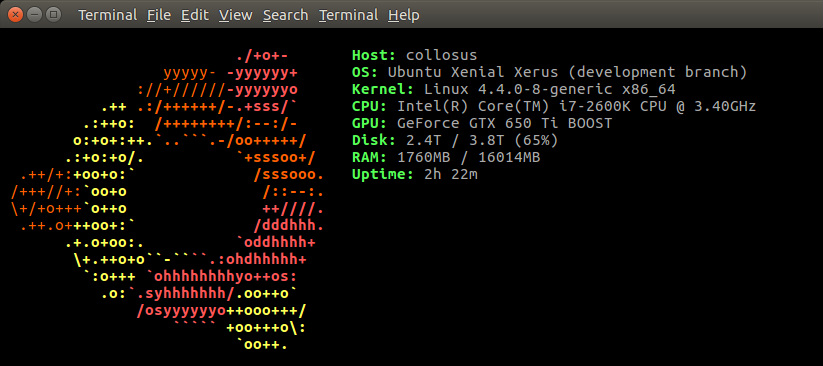

------------------
screenfetch-ubuntu
------------------

**shell script to display Ubuntu ASCII art logo and system info**

This is a slimmed down fork of of the `screenfetch` script: https://github.com/KittyKatt/screenFetch 

screenshot:

